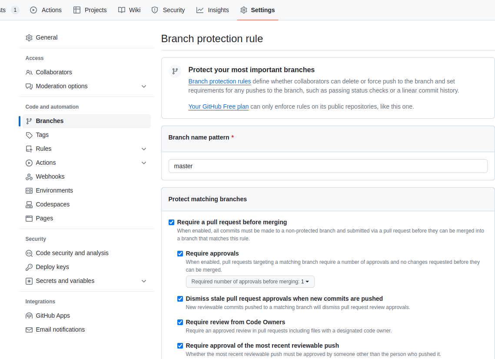
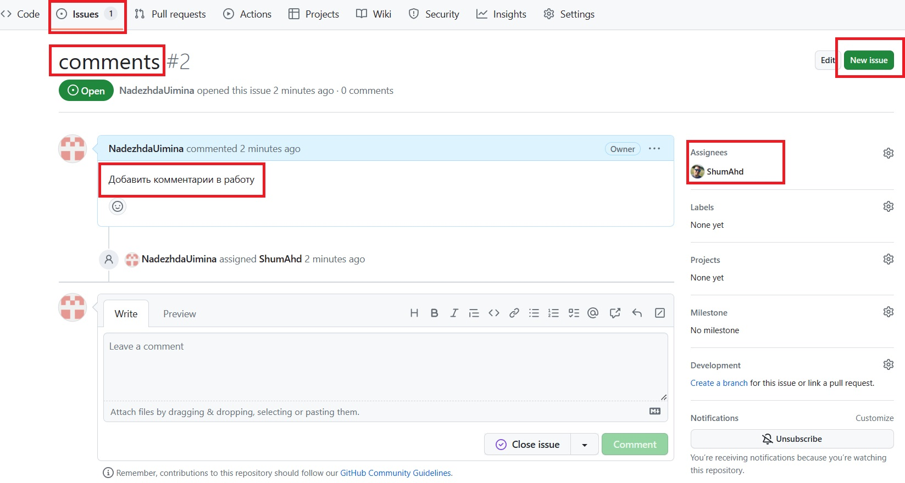
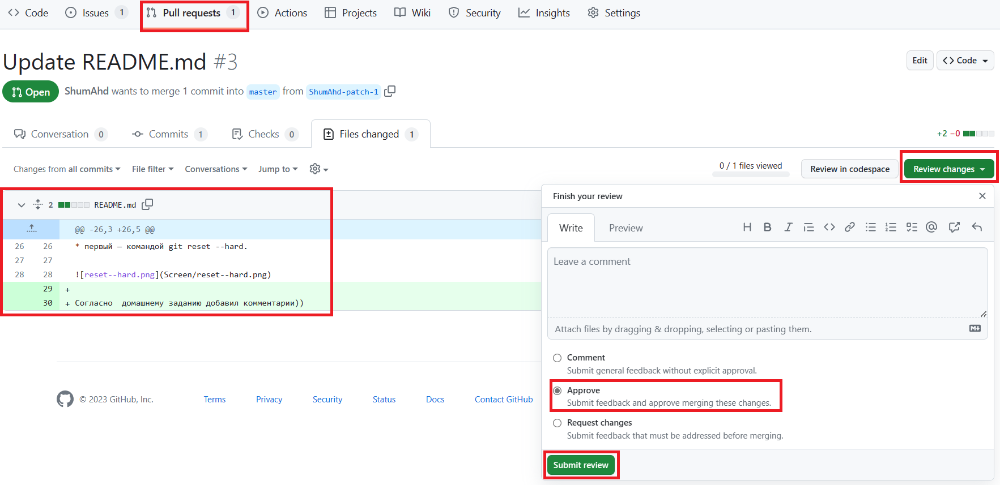
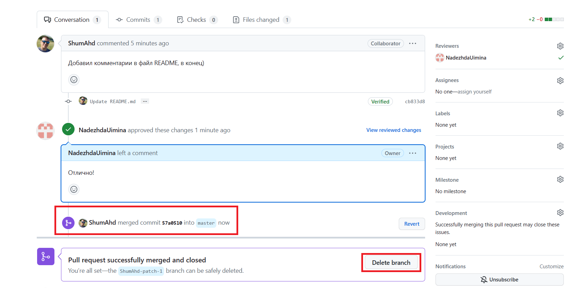

## Урок 3. Практики и инструменты для работы с Git

1. Пригласите в свой проект кого-то из коллег по обучению, дайте им доступ к своему репозиторию (кроме ветки master).

Защита ветки master

Добавляем в проект коллег

2. Поставьте ему в GitHub задачу по своему проекту, попросите её выполнить в отдельной ветке, а после выполнения — создать pull request и перевести задачу обратно на вас.

3. Проверьте выполнение задачи, примите pull request и удалите ветку, в которой решалась данная задача.

Проверка и принятие изменений

Удаление лишней ветки

Согласно  домашнему заданию добавил комментарии))